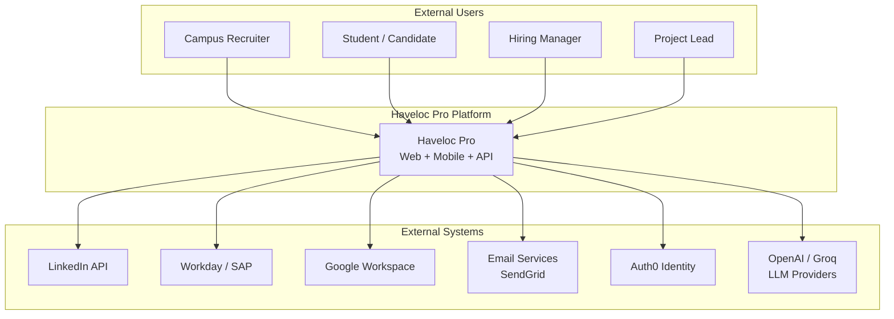
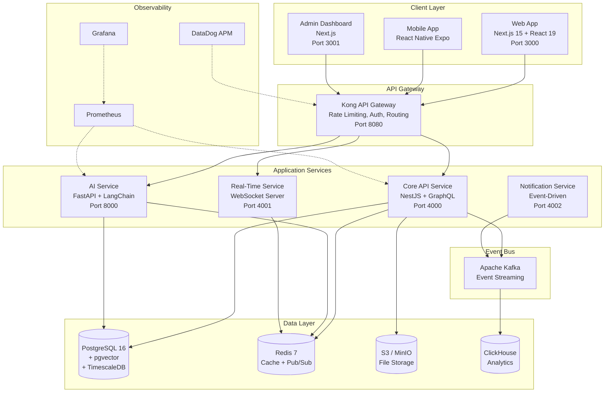
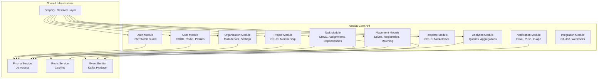
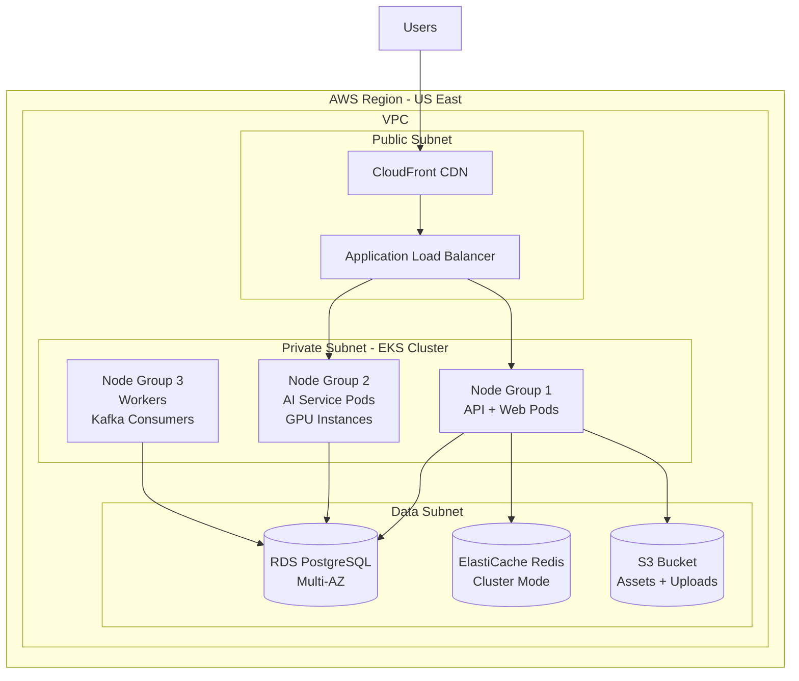
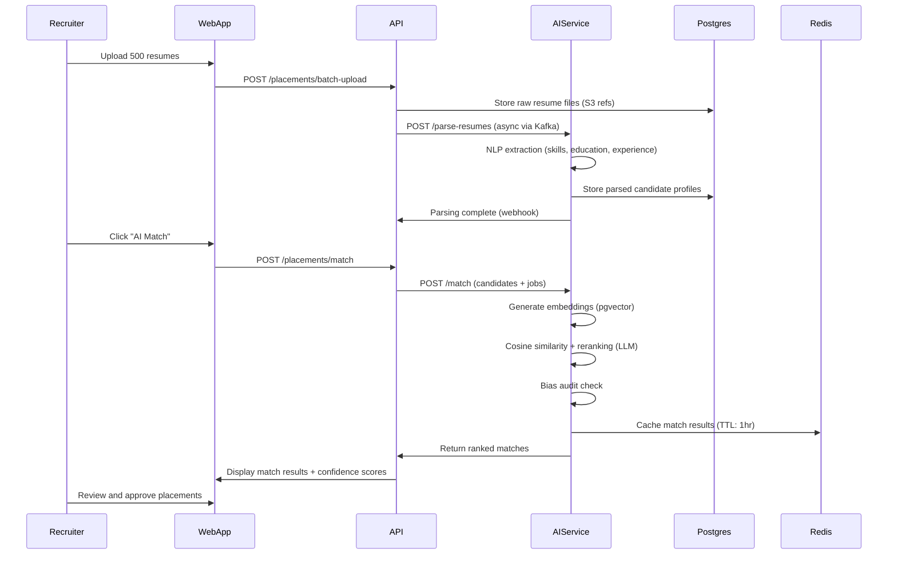

# Haveloc Pro — Architecture Document

**Version:** 1.0 | **Date:** 2026-02-16

---

## 1. C4 Context Diagram

---

## 2. C4 Container Diagram

---

## 3. C4 Component Diagram — Core API Service

---

## 4. Deployment Topology

---

## 5. Data Flow — Placement Matching

---

## 6. Non-Functional Architecture Decisions

| Concern | Solution | Details |
|---------|----------|---------|
| **Rate Limiting** | Redis sliding window | 100 req/min per user, 1000 req/min per org |
| **Caching** | CDN (CloudFront) + Redis | Static assets: CDN, API responses: Redis (TTL-based) |
| **4xx/5xx Handling** | Global exception filter (NestJS) | Structured error responses, correlation IDs, Sentry alerts |
| **Circuit Breaker** | Resilience4j pattern | AI service calls wrapped in circuit breaker with fallback |
| **Idempotency** | Idempotency keys | All POST/PUT endpoints accept `Idempotency-Key` header |
| **Audit Logging** | Kafka → ClickHouse | All mutations logged with actor, timestamp, diff |
| **Multi-Tenancy** | Row-level security (Postgres RLS) | `org_id` column on all tables, enforced at DB level |

---

*Architecture approved for Phase 3 implementation.*
