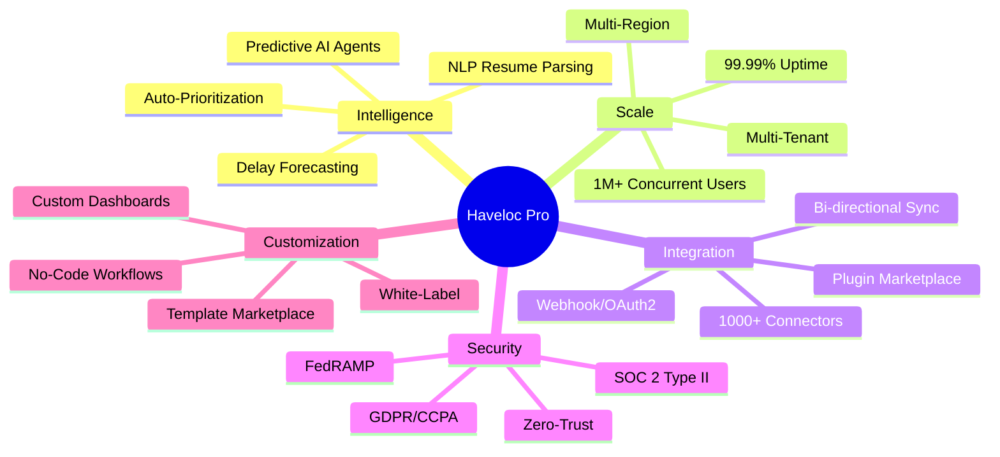
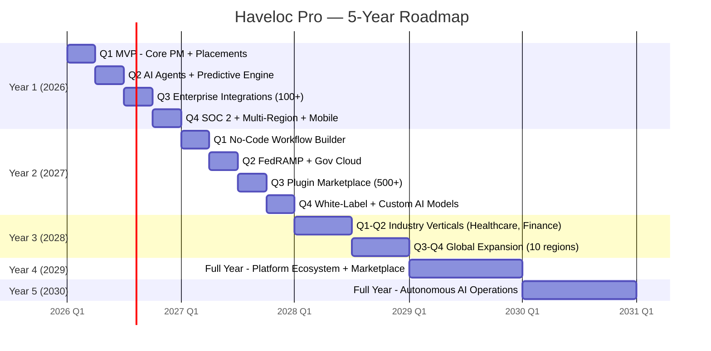

# Haveloc Pro — Product Requirements Document (PRD)

**Version:** 1.0  
**Date:** 2026-02-16  
**Authors:** Engineering Leadership, Product Management  
**Status:** Approved for MVP Development  
**Classification:** Internal — Confidential  

---

## Table of Contents

1. [Executive Summary](#1-executive-summary)
2. [Problem Statement](#2-problem-statement)
3. [Vision & Strategy](#3-vision--strategy)
4. [User Personas](#4-user-personas)
5. [User Stories](#5-user-stories)
6. [Feature Requirements](#6-feature-requirements)
7. [Non-Functional Requirements](#7-non-functional-requirements)
8. [Success Metrics & KPIs](#8-success-metrics--kpis)
9. [5-Year Roadmap](#9-5-year-roadmap)
10. [Competitive Analysis](#10-competitive-analysis)
11. [Risks & Mitigations](#11-risks--mitigations)
12. [Appendix](#12-appendix)

---

## 1. Executive Summary

**Haveloc Pro** is a next-generation, AI-native enterprise platform for project management, team collaboration, and placement automation. It evolves from the existing Haveloc platform (app.haveloc.com) into a 10x more powerful, globally scalable SaaS product serving Fortune 500 enterprises, universities, and government agencies.

**Key differentiators over Haveloc:**
- **Predictive AI agents** that auto-generate tasks, forecast delays, and match candidates to roles
- **1M+ concurrent user capacity** via event-driven microservices architecture
- **1000+ integrations** through a plug-and-play marketplace
- **Zero-trust security** with SOC 2 Type II, FedRAMP, GDPR/CCPA compliance
- **No-code/low-code workflow builder** for custom automation

**Budget:** $50M+ | **Team:** 100+ engineers | **Timeline:** 5-year roadmap, Q1 2026 MVP

---

## 2. Problem Statement

### Current State (Haveloc)
Haveloc addresses campus placement automation and project management with real-time task synchronization, obstacle anticipation, and topic-based communication. However, it has critical limitations:

| Gap | Impact |
|-----|--------|
| No AI/ML intelligence | Manual task creation, no predictive insights, no candidate matching |
| Basic scalability | Cannot serve >10K concurrent users reliably |
| Limited integrations | No Workday, LinkedIn, SAP, or HRIS connectors |
| No advanced analytics | Basic reports, no forecasting or trend analysis |
| Single-tenant architecture | Cannot serve enterprise multi-org deployments |
| Compliance gaps | Not SOC 2/FedRAMP/HIPAA certified |

### Desired State (Haveloc Pro)
An AI-native platform that:
1. **Automates 80%** of repetitive project/placement tasks via intelligent agents
2. **Predicts and prevents** project delays and placement bottlenecks before they occur
3. **Scales horizontally** to serve 10M+ users across global regions
4. **Integrates** with every major enterprise tool out of the box
5. **Complies** with global security and privacy regulations

---

## 3. Vision & Strategy

### Product Vision
> *"Make every team and placement process 10x faster, smarter, and stress-free — powered by AI that anticipates what you need before you ask."*

### Strategic Pillars



---

## 4. User Personas

### Persona 1: Campus Recruiter — "Priya" (Primary)
- **Role:** Training & Placement Officer, SRM University
- **Goals:** Place 5,000+ students per year across 200+ companies with minimal manual effort
- **Pains:** Manually matching resumes to JDs, tracking 50+ concurrent drives, no predictive visibility into placement rates
- **Needs:** AI candidate-job matching, automated drive scheduling, real-time placement dashboards
- **Tech Savvy:** Medium — needs intuitive UI, no-code automations

### Persona 2: Enterprise HR Lead — "Marcus"
- **Role:** VP of Talent Acquisition, Fortune 500 manufacturing company
- **Goals:** Reduce time-to-hire by 40%, manage 10K+ annual hires across 30 countries
- **Pains:** Fragmented tools (Workday + Lever + spreadsheets), no cross-department visibility, compliance risk
- **Needs:** Unified platform with HRIS integration, compliance dashboards, role-based access
- **Tech Savvy:** Low-Medium — expects enterprise-grade UX

### Persona 3: Student / Candidate — "Aisha"
- **Role:** Final-year CS student at a top engineering college
- **Goals:** Land placement at a product company; track application statuses in real-time
- **Pains:** No visibility into where she stands, inconsistent communication from placement cell
- **Needs:** Mobile-first portal, AI resume suggestions, real-time drive status, interview prep
- **Tech Savvy:** High — expects modern, fast, mobile-native experience

### Persona 4: Hiring Manager — "David"
- **Role:** Engineering Manager at a mid-stage startup
- **Goals:** Hire 15 interns from campus in 2 weeks; evaluate coding + culture fit
- **Pains:** Flooded with resumes, no structured evaluation pipeline, bias in screening
- **Needs:** AI-screened shortlists, structured scorecards, bias audit reports, scheduling automation
- **Tech Savvy:** High — wants API access and custom integrations

### Persona 5: Project Lead / Team Manager — "Sofia"
- **Role:** Program Manager at a consulting firm using Haveloc for client projects
- **Goals:** Deliver 12 projects on time with distributed teams
- **Pains:** Missed deadlines from hidden dependencies, manual status roll-ups, siloed communication
- **Needs:** AI-predicted blockers, automated status reports, dependency graphs, topic threads
- **Tech Savvy:** Medium-High

---

## 5. User Stories

### 5.1 Placement Automation

```gherkin
Feature: AI Candidate-Job Matching
  As a campus recruiter
  I want to auto-match candidates to job openings via AI skills parsing
  So that placements increase 3x and manual screening time drops 80%

  Scenario: Bulk resume upload and matching
    Given 500 student resumes are uploaded in PDF/DOCX format
    And 20 active job descriptions exist in the system
    When the recruiter clicks "AI Match"
    Then the system parses all resumes using NLP
    And generates a ranked match list per job with confidence scores (0-100)
    And flags potential bias indicators for audit
    And completes processing within 60 seconds

  Scenario: Real-time placement drive tracking
    Given a placement drive for "TechCorp" is scheduled for March 15
    When 200 students register for the drive
    Then the dashboard shows real-time registration count
    And AI predicts expected attendance (±5% accuracy)
    And auto-sends reminders 48h and 2h before the drive
```

### 5.2 Intelligent Task Management

```gherkin
Feature: AI Task Generation from Context
  As a project lead
  I want AI to auto-generate actionable tasks from meeting notes and emails
  So that nothing falls through the cracks and my team stays unblocked

  Scenario: Generate tasks from meeting transcript
    Given a meeting transcript is uploaded or pasted
    When the system processes the transcript
    Then it extracts action items with assignees, due dates, and priorities
    And creates linked tasks in the project board
    And sends notifications to assignees

  Scenario: Auto-unblock via dependency analysis
    Given Task B depends on Task A
    And Task A is overdue by 2 days
    When the system detects the blocker
    Then it notifies the Task A owner and their manager
    And suggests reallocation or scope adjustment
    And escalates if unresolved within 24 hours
```

### 5.3 Real-Time Collaboration

```gherkin
Feature: Topic-Based Communication Threads
  As a team member
  I want topic-specific threads attached to tasks and projects
  So that discussions are contextual and searchable

  Scenario: Thread with AI summary
    Given a thread has 50+ messages over 3 days
    When a new member joins the project
    Then AI generates a concise summary of the thread
    And highlights unresolved decisions and action items
    And provides links to relevant attachments
```

### 5.4 Predictive Analytics

```gherkin
Feature: Project Delay Forecasting
  As an executive sponsor
  I want AI to predict project completion dates based on velocity and blockers
  So that I can proactively intervene before deadlines are missed

  Scenario: Delay prediction dashboard
    Given a project has 120 tasks across 5 sprints
    And current velocity is 18 tasks/sprint (target: 24)
    When I open the analytics dashboard
    Then it shows predicted completion date (with confidence interval)
    And highlights the top 3 risk factors causing the delay
    And recommends specific actions to get back on track
```

### 5.5 Templates & Workflows

```gherkin
Feature: AI-Customized Templates
  As a new university onboarding to Haveloc Pro
  I want pre-built templates tailored to my institution type
  So that I can launch my first placement drive in under 1 hour

  Scenario: Template recommendation
    Given I specify "Engineering University, 5000 students, India"
    When I browse the template marketplace
    Then the system recommends "Campus Placement Drive - Engineering (India)"
    And auto-populates timelines, stages, and communication templates
    And allows customization via drag-and-drop workflow builder
```

---

## 6. Feature Requirements

### 6.1 MVP (Q1 2026) — Must Have

| Feature | Description | Priority |
|---------|-------------|----------|
| **Dashboard** | Project overview with KPIs, task summaries, upcoming deadlines | P0 |
| **Task Management** | Create, assign, tag, filter, Kanban/list/calendar views | P0 |
| **Placement Module** | Drive creation, student registration, company management | P0 |
| **AI Resume Parser** | NLP-based resume extraction (skills, education, experience) | P0 |
| **AI Job Matcher** | Candidate-job matching with confidence scores | P0 |
| **Topic Threads** | Contextual messaging attached to tasks/projects | P0 |
| **User Management** | RBAC, org hierarchy, SSO (Auth0) | P0 |
| **Notifications** | Email, in-app, push (mobile) for assignments and updates | P0 |
| **Templates** | Pre-built project and placement templates | P0 |
| **Reports** | Export PDF/CSV, scheduled reports, basic charts | P0 |

### 6.2 Q2 2026 — AI Agents

| Feature | Description | Priority |
|---------|-------------|----------|
| **AI Task Generator** | Auto-create tasks from emails, docs, transcripts | P1 |
| **Predictive Delay Engine** | ML-based project delay forecasting | P1 |
| **AI Thread Summaries** | Auto-summarize long discussion threads | P1 |
| **Smart Notifications** | AI prioritizes notifications by urgency/relevance | P1 |
| **Bias Audit Reports** | Detect and report bias in AI matching decisions | P1 |

### 6.3 Q3 2026 — Enterprise Integrations

| Feature | Description | Priority |
|---------|-------------|----------|
| **Plugin Marketplace** | Browse and install 100+ integrations | P2 |
| **Workday/SAP Connector** | Bi-directional sync with HRIS systems | P2 |
| **LinkedIn Integration** | Import candidate profiles, share postings | P2 |
| **Google Workspace** | Calendar sync, Drive attachments, Gmail actions | P2 |
| **Webhook Builder** | No-code webhook configuration for custom integrations | P2 |
| **API Gateway** | Public REST + GraphQL API with rate limiting | P2 |

### 6.4 Q4 2026 — Scale & Compliance

| Feature | Description | Priority |
|---------|-------------|----------|
| **Multi-Region Deploy** | US, EU, APAC data residency options | P2 |
| **SOC 2 Type II** | Complete audit and certification | P2 |
| **White-Label** | Custom branding per organization | P3 |
| **No-Code Workflow Builder** | Drag-and-drop automation builder (React Flow) | P3 |
| **Mobile App** | React Native Expo (iOS + Android) | P2 |

---

## 7. Non-Functional Requirements

### 7.1 Performance

| Metric | Target | Measurement |
|--------|--------|-------------|
| API Latency (p50) | < 50ms | DataDog APM |
| API Latency (p99) | < 200ms | DataDog APM |
| Page Load Time (LCP) | < 1.5s | Lighthouse |
| Time to Interactive | < 2.0s | Lighthouse |
| Throughput | 10,000 RPS sustained | k6 load tests |
| Concurrent Users | 1,000,000+ | WebSocket connections |

### 7.2 Reliability

| Metric | Target |
|--------|--------|
| Uptime SLA | 99.99% (52 min downtime/year) |
| RTO (Recovery Time Objective) | < 5 minutes |
| RPO (Recovery Point Objective) | < 1 minute |
| Zero-downtime deploys | Blue/Green + Canary |

### 7.3 Security

| Requirement | Implementation |
|-------------|----------------|
| Authentication | Auth0 (OAuth2/OIDC), MFA, SSO (SAML 2.0) |
| Authorization | RBAC + ABAC, per-org tenant isolation |
| Encryption at rest | AES-256 (AWS KMS) |
| Encryption in transit | TLS 1.3 everywhere |
| Network security | Zero-trust mesh (Istio), WAF (Cloudflare) |
| Secrets management | HashiCorp Vault |
| Vulnerability scanning | SAST (SonarQube), DAST (ZAP), SCA (Snyk) |
| Penetration testing | Annual third-party + continuous AI red-teaming |
| Audit logging | Immutable audit trail, 7-year retention |

### 7.4 Compliance

| Framework | Status | Target Date |
|-----------|--------|-------------|
| GDPR | Required | MVP launch |
| CCPA | Required | MVP launch |
| SOC 2 Type II | Required | Q4 2026 |
| FedRAMP | Planned | Q2 2027 |
| HIPAA | Planned (healthcare vertical) | Q4 2027 |
| ISO 27001 | Planned | Q2 2028 |

### 7.5 Scalability

| Dimension | Target |
|-----------|--------|
| Users | 10M+ registered, 1M+ concurrent |
| Data Volume | 100TB+ (hot), PB-scale (archival) |
| AI Inference | 1B+ inferences/month |
| Tenants | 10,000+ organizations |
| Integrations | 1,000+ API connectors |

### 7.6 Accessibility
- **Standard:** WCAG 2.2 AA compliance
- **Tooling:** Automated Lighthouse audits in CI, manual screen reader testing quarterly
- **Requirements:** Keyboard navigation, ARIA labels, color contrast ≥ 4.5:1, focus indicators, skip navigation

### 7.7 Internationalization
- UTF-8 everywhere, ICU message format
- RTL layout support
- Locale-aware date/time/currency formatting
- Translation pipeline (Crowdin) for 12+ languages at launch

---

## 8. Success Metrics & KPIs

### Primary KPIs

| Metric | Target | Baseline (Haveloc) |
|--------|--------|---------------------|
| Platform Uptime | 99.99% | ~99.5% |
| API Latency (p99) | < 200ms | ~800ms |
| Placement Cycle Time | -50% reduction | ~45 days avg |
| User NPS | > 90 | ~65 |
| AI Match Accuracy | > 85% | N/A |
| Feature Adoption (AI) | > 60% of active users | N/A |
| DAU/MAU Ratio | > 50% | ~30% |
| Time to First Value | < 10 minutes | ~2 hours |

### OKR Framework (Q1 2026)

**Objective 1:** Launch Haveloc Pro MVP to 10 pilot customers
- KR1: 100% of MVP features deployed and functional
- KR2: < 5 P0 bugs in first 30 days
- KR3: 8/10 avg CSAT from pilot users

**Objective 2:** Demonstrate AI superiority over Haveloc
- KR1: AI matcher achieves >80% accuracy on test dataset
- KR2: AI task generator saves users >2 hours/week (measured)
- KR3: Predictive engine forecasts delays with <10% error

**Objective 3:** Achieve enterprise-grade reliability
- KR1: Pass SOC 2 Type II readiness assessment
- KR2: 99.99% uptime during pilot
- KR3: Zero data breaches or security incidents

---

## 9. 5-Year Roadmap



---

## 10. Competitive Analysis

| Capability | Haveloc | Monday.com | Asana | Jira | **Haveloc Pro** |
|------------|---------|------------|-------|------|-----------------|
| Task Management | ✅ Basic | ✅ Advanced | ✅ Advanced | ✅ Advanced | ✅ **AI-Native** |
| Placement Automation | ✅ Core focus | ❌ | ❌ | ❌ | ✅ **AI-Powered** |
| AI Agents | ❌ | 🟡 Basic | 🟡 Basic | 🟡 Atlassian AI | ✅ **Custom RAG + Fine-tuned** |
| Real-Time Collab | ✅ Basic | ✅ | ✅ | ❌ | ✅ **Multiplayer + AI Summaries** |
| Predictive Analytics | ❌ | ❌ | 🟡 Basic | ❌ | ✅ **ML Forecasting** |
| Enterprise Scale | ❌ | ✅ | ✅ | ✅ | ✅ **1M+ concurrent** |
| Integrations | ❌ Limited | ✅ 200+ | ✅ 200+ | ✅ 3000+ | ✅ **1000+ planned** |
| Compliance (SOC2/FedRAMP) | ❌ | ✅ | ✅ | ✅ | ✅ **Planned** |
| No-Code Workflows | ❌ | ✅ | ❌ | ❌ | ✅ **React Flow** |
| Bias Auditing | ❌ | ❌ | ❌ | ❌ | ✅ **Built-in** |

**Unique Moat:** Haveloc Pro is the only platform combining enterprise PM + placement automation + AI agents in a single platform.

---

## 11. Risks & Mitigations

| Risk | Likelihood | Impact | Mitigation |
|------|-----------|--------|------------|
| AI model accuracy below threshold | Medium | High | Multi-model ensemble, human-in-the-loop fallback, continuous fine-tuning |
| Data privacy breach | Low | Critical | Zero-trust architecture, encryption everywhere, quarterly pen tests |
| Scaling bottleneck in DB | Medium | High | Horizontal sharding (Citus), read replicas, caching (Redis), async writes |
| Talent attrition (AI engineers) | Medium | High | Competitive comp, internal ML training, rotational programs |
| Competitor launches AI PM tool | High | Medium | Speed-to-market focus, unique placement vertical moat |
| Regulatory changes (AI Act, etc.) | Medium | Medium | Modular AI layer, configurable guardrails, legal counsel on advisory board |
| Integration partner API changes | High | Low | Abstraction layer, webhook fallbacks, partner SLAs |

---

## 12. Appendix

### A. Glossary
- **DAU/MAU:** Daily/Monthly Active Users
- **RAG:** Retrieval-Augmented Generation (AI pattern)
- **RBAC/ABAC:** Role/Attribute-Based Access Control
- **RPS:** Requests Per Second
- **NPS:** Net Promoter Score
- **CSAT:** Customer Satisfaction Score
- **SLO/SLI:** Service Level Objective/Indicator

### B. Reference Links
- Haveloc Platform: https://app.haveloc.com/
- Auth0: https://auth0.com/
- LangChain: https://langchain.com/
- Prisma: https://prisma.io/
- TurboRepo: https://turbo.build/

### C. Document History
| Version | Date | Author | Changes |
|---------|------|--------|---------|
| 1.0 | 2026-02-16 | Engineering Leadership | Initial PRD |

---

*End of PRD — Approved for MVP development.*
