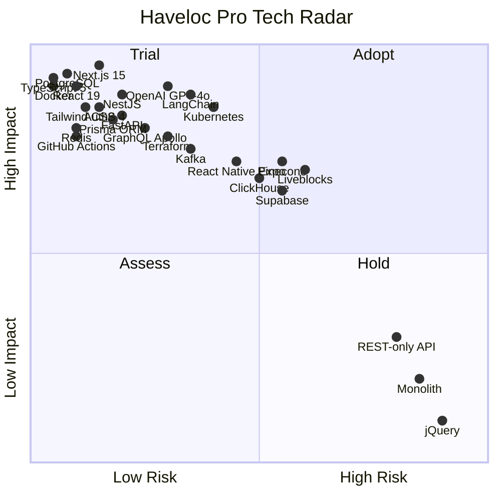

# Haveloc Pro — Technology Radar

**Version:** 1.0 | **Date:** 2026-02-16 | **Review Cycle:** Quarterly

---

## Radar Visualization

---

## Detailed Categorization

### 🟢 ADOPT — Production-ready, team-wide default

| Technology | Category | Rationale |
|-----------|----------|-----------|
| **Next.js 15** | Frontend Framework | App Router, RSC, streaming SSR, Vercel-native. Industry standard for React apps. |
| **React 19** | UI Library | Concurrent features, use() hook, server components. No viable alternative at scale. |
| **TypeScript 5.x** | Language | Type safety, DX, refactoring confidence. Non-negotiable for enterprise codebases. |
| **Tailwind CSS 4** | Styling | Utility-first, design tokens, tree-shaking. Pairs with shadcn/ui for component library. |
| **shadcn/ui** | Component Library | Accessible, composable, copy-paste components built on Radix UI primitives. |
| **NestJS** | Backend Framework | Modular architecture, DI, decorators, GraphQL-native. Best Node.js enterprise framework. |
| **PostgreSQL 16** | Primary Database | ACID, JSON support, pgvector for embeddings, TimescaleDB for time-series. Battle-tested. |
| **Redis 7** | Cache / Pub-Sub | Rate limiting, session store, real-time pub/sub, sorted sets for leaderboards. |
| **Prisma 6** | ORM | Type-safe queries, migrations, schema-first. Best DX for TypeScript + Postgres. |
| **Docker** | Containerization | Standard containerization. Required for reproducible builds and K8s deployment. |
| **GitHub Actions** | CI/CD | Native to GitHub. Matrix builds, reusable workflows, extensive marketplace. |
| **Auth0** | Authentication | OAuth2/OIDC, MFA, SSO (SAML), social login. Enterprise-grade with compliance certs. |
| **FastAPI** | AI Service API | Async Python, auto-OpenAPI docs, Pydantic validation. Best for ML service hosting. |
| **Zustand** | State Management | Minimal boilerplate, TypeScript-first, performant. Replaces Redux for most use cases. |
| **Zod** | Validation | Runtime + compile-time validation. Pairs with Prisma and tRPC for end-to-end type safety. |
| **SonarQube** | SAST | Static analysis, code quality gates, security hotspot detection. CI-integrated. |
| **Snyk** | SCA | Dependency vulnerability scanning. Catches supply chain attacks. |
| **Prometheus + Grafana** | Monitoring | Open-source observability stack. Custom dashboards, alerting, SLO tracking. |
| **ESLint + Prettier** | Code Quality | Consistent formatting and lint rules across monorepo. |

---

### 🟡 TRIAL — Promising, using in specific services / POCs

| Technology | Category | Rationale | Risk |
|-----------|----------|-----------|------|
| **LangChain** | AI Orchestration | Agent chains, RAG pipelines, tool use. Rapid AI prototyping. | API surface instability, vendor lock-in to LLM providers. |
| **OpenAI GPT-4o** | LLM | Best multi-modal model for resume parsing and task generation. | Cost at scale ($), rate limits, data privacy concerns. Mitigated by LiteLLM gateway. |
| **Kafka (Confluent)** | Event Streaming | Event-driven architecture, CDC, async processing. | Operational complexity. Start with managed Confluent Cloud. |
| **Kubernetes (EKS)** | Orchestration | Auto-scaling, service mesh, rolling deploys. Required for 1M+ scale. | Steep learning curve. Use managed EKS/GKE with Helm charts. |
| **Terraform** | IaC | Declarative infra. Multi-cloud capable. | State management complexity. Use Terraform Cloud for state. |
| **GraphQL (Apollo)** | API Layer | Flexible queries, real-time subscriptions, schema stitching. | Caching complexity, N+1 queries. Use DataLoader pattern. |
| **React Flow** | Workflow Builder | No-code visual workflow editor. Extensible, React-native. | Performance with 500+ nodes. Virtualization needed. |
| **Recharts** | Data Visualization | React-native charts. Better than Chart.js for React integration. | Limited chart types vs D3. Supplement with D3 for custom viz. |
| **Playwright** | E2E Testing | Cross-browser, fast, reliable. Official Microsoft support. | Test maintenance cost for large UI surface. |

---

### 🔵 ASSESS — Evaluating for future adoption

| Technology | Category | Rationale | Decision Timeline |
|-----------|----------|-----------|-------------------|
| **Supabase** | Backend-as-a-Service | Postgres + Auth + Realtime + Storage in one platform. Could simplify early architecture. | Q2 2026 — evaluate vs self-hosted Postgres. |
| **Liveblocks / Yjs** | Real-Time Collaboration | Conflict-free replicated data types (CRDTs) for multiplayer editing. | Q2 2026 — assess for collaborative doc editing feature. |
| **React Native Expo** | Mobile App | Cross-platform mobile from shared codebase. Expo Router, OTA updates. | Q3 2026 — prototype after web MVP stabilizes. |
| **ClickHouse** | Analytics DB | Columnar storage, fast aggregations. Great for analytics dashboards. | Q3 2026 — evaluate vs TimescaleDB for analytics workload. |
| **Pinecone** | Vector Database | Managed vector search for AI embeddings. Simple API. | Q2 2026 — compare vs pgvector (in Postgres) for scale. |
| **Groq** | LLM Inference | Ultra-fast inference (LPU). 10x faster than GPU for supported models. | Q2 2026 — benchmark against OpenAI for latency-critical paths. |
| **Llama 3 (fine-tuned)** | Self-Hosted LLM | Data sovereignty, lower inference cost at scale. | Q3 2026 — fine-tune on placement data after data pipeline matures. |
| **Cloudflare Workers** | Edge Compute | Low-latency edge API. Could replace some Lambda@Edge usage. | Q4 2026 — evaluate for API gateway / static caching. |
| **Turso (libSQL)** | Edge Database | SQLite at the edge. Great for read-heavy, latency-sensitive queries. | Q4 2026 — evaluate for user preferences / sessions. |
| **Temporal** | Workflow Engine | Durable workflows, retries, long-running processes. | Q3 2026 — evaluate for complex placement pipelines. |

---

### 🔴 HOLD — Do not use / phase out

| Technology | Category | Rationale |
|-----------|----------|-----------|
| **Monolithic Architecture** | Architecture | Cannot scale to 1M+ users. Haveloc's current limitation. Migrate to modular monorepo → microservices. |
| **jQuery** | Frontend | Legacy. No place in a modern React codebase. |
| **REST-only API** | API | GraphQL preferred for flexible client queries. REST reserved for simple webhooks/integrations. |
| **MongoDB** | Database | Relational data model is a better fit. Postgres + pgvector covers all use cases including document and vector. |
| **Redux** | State Management | Excessive boilerplate. Zustand / Jotai are simpler and more performant for our needs. |
| **Heroku** | Hosting | Not enterprise-grade. AWS EKS/GKE with Terraform for production. |
| **Firebase** | BaaS | Google lock-in, limited Postgres compatibility, scaling ceiling. Supabase preferred if BaaS needed. |
| **Webpack** | Bundler | Slow builds. TurboRepo + Next.js (Turbopack) + Vite for packages. |
| **Express.js** | Backend | NestJS provides better structure, DI, and enterprise patterns. Express remains as underlying HTTP layer only. |
| **Jenkins** | CI/CD | Legacy CI. GitHub Actions is native and sufficient. |

---

## Decision Records

### ADR-001: GraphQL over REST for primary API
**Context:** Need flexible queries for dashboard widgets with varying data needs.  
**Decision:** GraphQL (Apollo Server) as primary API. REST endpoints for webhooks and simple integrations.  
**Consequences:** Need DataLoader for N+1 prevention, schema governance process, client-side cache management.

### ADR-002: Postgres + pgvector over dedicated Vector DB
**Context:** AI features need vector similarity search. Pinecone is purpose-built but adds operational cost.  
**Decision:** Start with pgvector extension in Postgres. Evaluate Pinecone at >10M vectors.  
**Consequences:** Simpler ops (one DB), slightly lower vector search performance at extreme scale. Acceptable for MVP.

### ADR-003: TurboRepo Monorepo over Polyrepo
**Context:** Multiple apps (web, mobile, admin) sharing code (UI, DB, AI).  
**Decision:** TurboRepo monorepo with shared packages. Publish to internal npm registry if needed later.  
**Consequences:** Faster development velocity, shared tooling, atomic commits. Risk of coupling — mitigated by clear package boundaries.

### ADR-004: Auth0 over custom auth
**Context:** Enterprise SSO (SAML), MFA, social login, compliance requirements.  
**Decision:** Auth0 for MVP. Evaluate self-hosted Keycloak for cost optimization at scale.  
**Consequences:** Fast time-to-market, compliance-ready. Monthly cost scales with MAU ($$$$ at 1M+).

---

*Reviewed quarterly. Next review: Q2 2026.*
